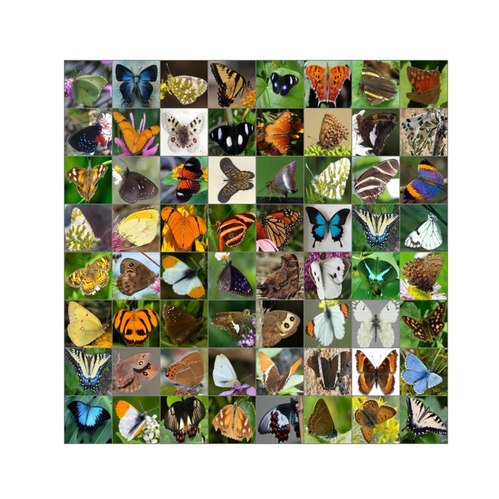
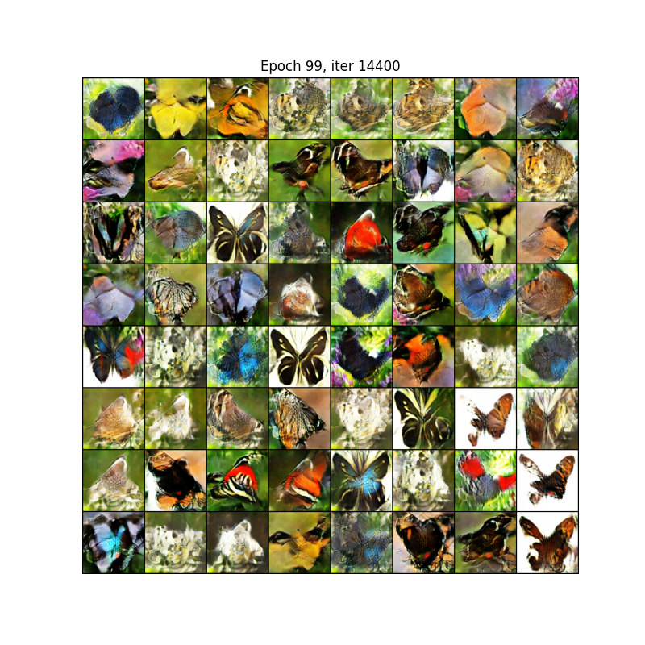

<body>
<h1># DCGAN</h1>

This repository focuses on training a Deep Convolutional Generative Adversarial Network (DCGAN) on a dataset of butterfly images.  
The goal is to generate realistic butterfly images. Additionally, differentiable augmentations were applied during                        training to improve the model's performance. The quality of the generated images was evaluated using the                                  Fréchet Inception Distance (FID) metric. 

<b><h6>Dataset</h6></b>  
The dataset consists of high-quality butterfly images. The images were preprocessed to ensure consistency in size and format.  
the dataset was taken from kaggle and can be found <a href = "https://www.kaggle.com/datasets/phucthaiv02/butterfly-image-classification/data">here</a> 

  <h6><b>Architecture</b></h6>
The DCGAN consists of two main components: the Generator and the Discriminator.
<b>Generator</b>
Two architectures were experimented with:
Transpose Convolutions:
Uses transposed convolutional layers to upsample the latent vector into an image.
Upsampling with Convolutions:
Uses a combination of upsampling layers (e.g., bilinear or nearest-neighbor) followed by convolutional layers. This approach yielded better results.
<b>Discriminator</b>
A standard convolutional neural network (CNN) was used to classify images as real or fake.
Leaky ReLU activations and dropout layers were incorporated to improve stability.

  <h6><b>Training</b></h6>
Differentiable Augmentations: Applied to the training data to improve generalization and prevent overfitting. More information can be found <a href = "https://github.com/mit-han-lab/data-efficient-gans/blob/master/DiffAugment_pytorch.py">here</a> 
Optimizer: Adam optimizer was used for both the generator and discriminator. with learning rate of 1e-3 for generator and learning rate of 1e-4 for the discriminator. 
Loss Function: original DC GAN loss.

  <h6><b>Results</b></h6>
  the model was evaluated using Frechet Inception distance(FID). I got a FID score of 29.4831. 
  the fid was calculated by sampling 9000 examples from both original and generated distributions. 
  <b>original image</b>
  

  <b>generated images</b>
  

  

  
</body>

